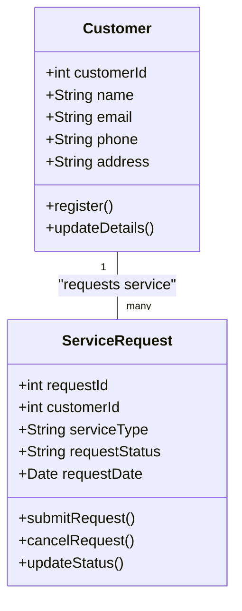

# **maven-Gas-Utility-casestudy**
## **Project Overview**
The Gas Utility Management System is a Core Java-based application designed to manage gas utility consumer services efficiently. It provides features to handle customer registrations, service requests, and complaint tracking while ensuring smooth operations for gas utility providers.

## **Features**
- **Manage customer registrations and account details.**
- **Allow consumers to request gas refills, maintenance, and other services.**
- **Track service requests and update their status.**
- **Exception handling for invalid customer IDs and service requests.**
- **Modular and scalable structure for future enhancements.**

## **Installation and Setup**
### **Prerequisites**
- Java Development Kit (JDK) 21.
- An Integrated Development Environment (IDE) such as IntelliJ IDEA or Eclipse.
- MySQL Database (for persistence).
- Git (optional, for version control).
- Maven (for dependency management).

### **Steps**
1. Clone the repository:
   ```sh
   - git clone https://github.com/OmK-codes/maven-Gas-Utility-casestudy.git
   ```
2. Navigate to the project directory:
   ```sh
   - cd maven-Gas-Utility-casestudy
   ```
3. Open the project in your preferred IDE.
4. Compile and run the application:
   ```sh
   - mvn clean install
   - mvn spring-boot:run  # Once Spring Boot is added
   ```

---

## **Code Structure**
### **Package Structure**
```plaintext
com.omkcodes.gasutility
│── controller
│   ├── CustomerController.java
│   ├── ServiceRequestController.java
│
│── service
│   ├── CustomerService.java
│   ├── ServiceRequestService.java
│   ├── TestConnectionService.java
│
│── service.impl
│   ├── CustomerServiceImpl.java
│   ├── ServiceRequestServiceImpl.java
│
│── repository
│   ├── CustomerRepository.java
│   ├── ServiceRequestRepository.java
│
│── model
│   ├── Customer.java
│   ├── ServiceRequest.java
│
│── enums
│   ├── CustomerStatus.java
│   ├── RequestStatus.java
│   ├── RequestType.java
│
│── exception
│   ├── InvalidCustomerIDException.java
│   ├── InvalidServiceRequestException.java
│   ├── ResourceNotFoundException.java
│   ├── ServiceRequestException.java
│
│── main
│   ├── GasUtilityApplication.java
```

---

## **Database Schema (POJO Classes)**
| **Entity**          | **Attributes**                                                       |
|---------------------|---------------------------------------------------------------------|
| **Customer**       | customerId, name, email, phone, address, customerStatus            |
| **ServiceRequest** | requestId, customerId, serviceType, requestStatus, requestDate     |
| **GasConnection**  | connectionId, customerId, connectionType, connectionStatus         |
| **Billing**        | billId, customerId, amountDue, dueDate, paymentStatus              |
| **Payment**        | paymentId, customerId, amountPaid, paymentDate, paymentMethod      |

---

## **Class Diagram of Gas Utility Management System**

